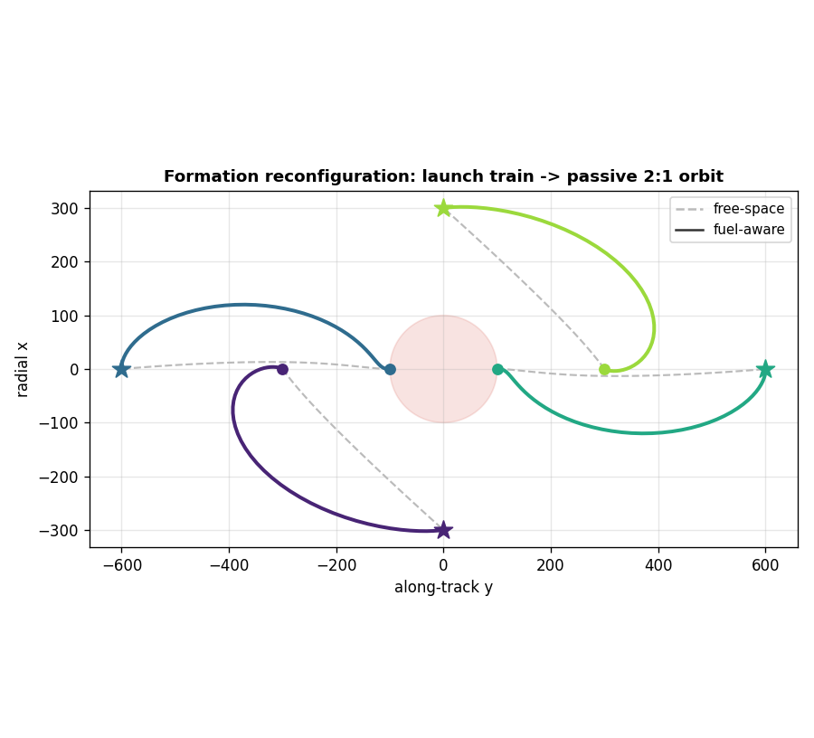
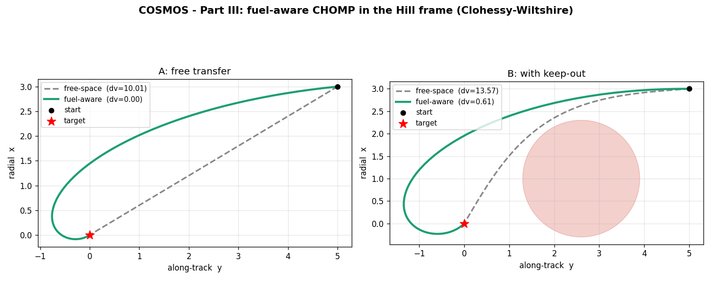
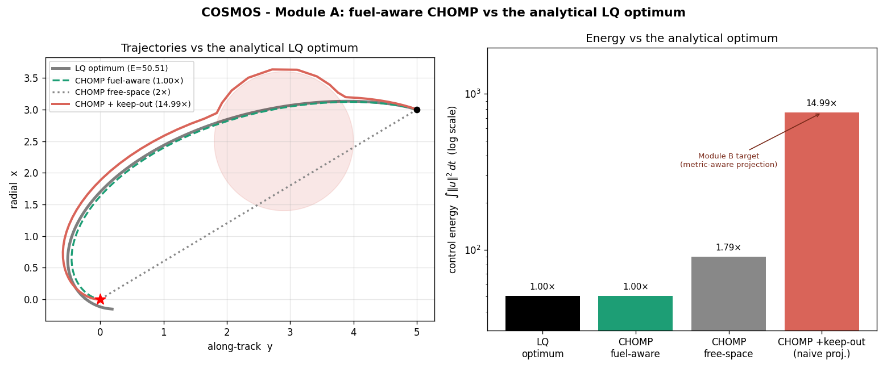
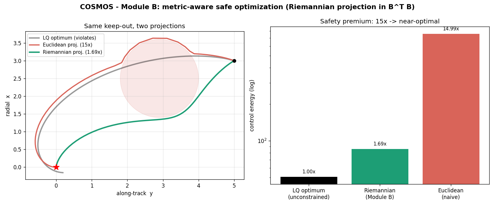
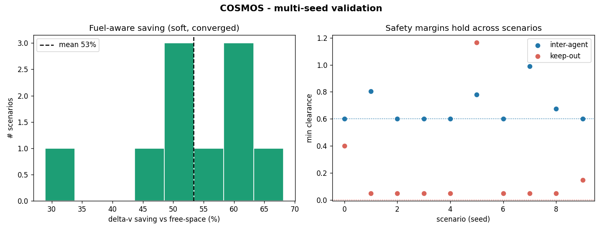
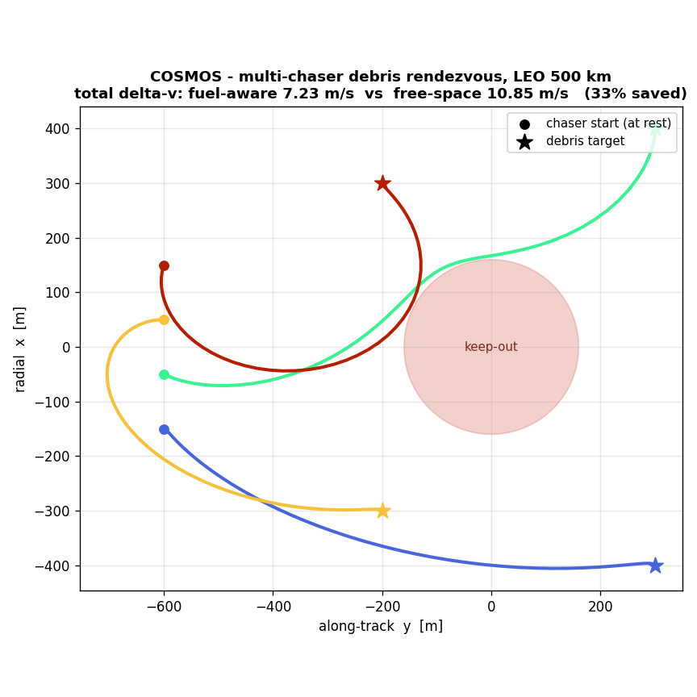
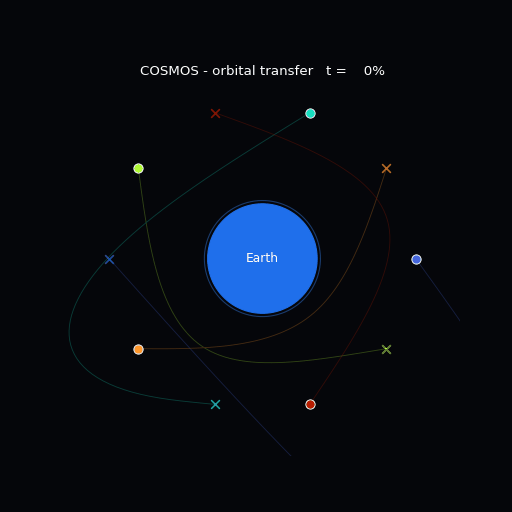

<div align="center">

# 🛰️ COSMOS

### Energy-Aware Formation Reconfiguration via Covariant Optimization in the Clohessy–Wiltshire Metric

*Covariant Optimization for Swarm Maneuvers in Orbital Space*

[](https://www.python.org/)
[](https://numpy.org/)
[](https://scipy.org/)
[](LICENSE)

<br/>



*A four-satellite launch train reconfigures into a passive 2:1 relative orbit. Solid curves (fuel-aware) ride the natural orbital drift; dashed curves (free-space) push straight through it.*

</div>

---

## ✨ What is COSMOS?

COSMOS plans **fuel-optimal trajectories for a swarm of satellites** moving relative to one another in low Earth orbit. It takes a motion-planning idea — the **covariant gradient descent of [CHOMP](https://ieeexplore.ieee.org/document/5152817)** — and makes it *aware of orbital mechanics*.

The one-sentence idea:

> **Standard trajectory smoothing minimizes acceleration. In orbit, the dynamics already supply free acceleration — so minimizing raw acceleration optimizes the wrong thing. COSMOS replaces the smoothness metric with one built from the Clohessy–Wiltshire dynamics, so "smoothness" becomes the actual thrust the engine must provide.**

That single substitution — from $A^\top A$ (raw acceleration) to $B^\top B$ (thrust energy in the orbital frame) — turns a generic path smoother into a fuel-aware orbital maneuver planner, and it does so while keeping CHOMP's elegant covariant structure intact.

## 🎯 Key results

| Metric | Result |
|---|---|
| Δv saving vs. dynamics-blind planning | **53% ± 10%** (validated over 10 random scenarios) |
| Optimality vs. analytical LQ optimum | **1.00×** (provably optimal in the energy sense) |
| Safe keep-out avoidance cost | **15× → 1.69×** (89% of wasted energy recovered) |
| Collision-free success rate | **100%** (hardened mode) |
| Realistic LEO (500 km) per-satellite cost | **~1–2 m/s**, arriving at cm/s |

## 💡 The core idea

CHOMP minimizes a functional combining smoothness and obstacle cost, and descends it with a **covariant** (metric-preconditioned) gradient:

$$U(\xi) = \lambda\, F_\text{fuel}(\xi) + F_\text{obs}(\xi) + \mu\, F_\text{agents}(\xi), \qquad \xi \leftarrow \xi - \alpha\, (B^\top B)^{-1}\, \nabla U(\xi)$$

The fuel term is the energy of the **thrust** — the part of the acceleration the dynamics do *not* provide for free:

$$F_\text{fuel} = \tfrac{1}{2}\!\int \big\lVert \ddot{\xi} - f_\text{CW}(\xi)\big\rVert^2\, dt, \qquad B = D_2 - G_\text{CW}$$

where $D_2$ is the discrete second-derivative operator and $G_\text{CW}$ encodes the linearized Clohessy–Wiltshire dynamics (the in-plane radial/along-track coupling, plus a decoupled cross-track oscillator in 3D). When the orbital rate $n \to 0$, $B \to D_2$ and COSMOS gracefully reduces to ordinary free-space CHOMP — a built-in sanity check the code verifies.

> **A note on honesty:** we optimize **control energy (L2)**, the smooth quantity that makes the Riemannian metric, its preconditioner, and the closed-form optimal benchmark possible. We *report* the realized **Δv (L1)**, the true propellant currency. This matches the continuous, low-thrust (electric-propulsion) regime that slow formation reconfiguration actually uses.

## ⚙️ Installation

```bash
git clone https://github.com/stanislaw-sommerfeld/cosmos.git
cd cosmos
python -m venv venv && source venv/bin/activate   # Windows: venv\Scripts\activate
pip install -e .                                   # add ".[viz]" for the pygame viewer
```

This installs the `cosmos` package (src-layout) and a `cosmos` command. Prefer plain dependencies instead? `pip install -r requirements.txt`.

## ▶️ Run the whole framework at once

One command runs the mission, every demonstration and analysis, regenerates **all figures** into `figures/`, prints **all numeric results**, and runs the **test suite**:

```bash
python run_all.py              # everything, incl. multi-seed validation — a few minutes
python run_all.py --fast       # skip the slow multi-seed sweeps (~1–2 min)
python run_all.py --smoke      # just a few quick steps (harness check)
python run_all.py --no-tests   # don't run pytest at the end
```

…or, equivalently, with `make`:

```bash
make all      # = python run_all.py        (full run + tests)
make fast     # = python run_all.py --fast
make test     # just the test suite
```

Figures are written to `figures/`; results print to the console. The two **interactive** pieces are standalone and intentionally *not* part of the batch:

```bash
python -m cosmos.pygame_orbital_sim   # real-time viewer (needs ".[viz]" + a display)
open cosmos_demo.html                 # interactive covariant-descent widget (any browser)
```

## 🚀 Usage

**The unified driver** — one command, configured by flags:

```bash
cosmos                                              # reconfig · fuel · riemannian · hungarian · 2D
cosmos --metric free --safety none --assign fixed   # dynamics-blind baseline (ablation)
cosmos --scenario debris --dim 3 --units si         # 3D debris rendezvous, real units
cosmos --units si --mode sim --out figure.png       # render a figure only
```

(`cosmos ...` is equivalent to `python -m cosmos.cli ...`.)

| Flag | Options |
|---|---|
| `--scenario` | `reconfig` · `debris` · `swarm` · `single` |
| `--metric` | `free` · `fuel` |
| `--safety` | `none` · `euclid` · `riemann` |
| `--assign` | `fixed` · `hungarian` |
| `--dim` | `2` · `3` |
| `--units` | `norm` · `si` |
| `--mode` | `sim` · `results` · `both` |

**Reproduce the headline figures** — each demonstration script is a package module, run with `python -m`:

```bash
python -m cosmos.chomp_cw          # the fuel-aware contribution
python -m cosmos.cosmos_validation # robustness (slowest; a few minutes)
python -m cosmos.cosmos_units      # credible m/s numbers
python -m cosmos.cosmos_optimal    # 1.00× LQ optimum + the 15× pitfall   (Module A)
python -m cosmos.cosmos_safe       # 15× → 1.69× safety fix                (Module B)
python -m cosmos.pygame_orbital_sim   # real-time viewer (needs ".[viz]" + a display)
```

Figures are written to the current directory.

## 🏗️ Architecture

The science is built up in layers, each a self-contained module inside the `cosmos` package. A single driver, [`cosmos/cli.py`](src/cosmos/cli.py), composes them into the full mission and is the one command you call.

```
                       cosmos.cli   ← unified mission driver (the `cosmos` command)
                            │
        ┌───────────────────┼────────────────────────────┐
   fuel-aware CW      optimal benchmark            safe projection
   metric (B^T B)     (LQ / Gramian, Module A)     (Riemannian, Module B)
        │                   │                            │
        └───────────────────┴────────────────────────────┘
                            │
              covariant CHOMP core  +  multi-agent decoupling
              (chomp_single_agent)     (chomp_swarm: Jacobi / Gauss–Seidel / priority)
```

| Stage | Module (`python -m cosmos.<name>`) | What it demonstrates |
|---|---|---|
| 1 | `chomp_single_agent` | Covariant CHOMP — one agent, one obstacle |
| 2 | `chomp_swarm` | Multi-agent planning, three decoupling strategies |
| 3 | `orbital_sim` · `pygame_orbital_sim` | Animation (GIF) and real-time viewer |
| 4 | `chomp_cw` | **The contribution:** fuel-aware CW metric $B^\top B$ |
| 5 | `cosmos_full` `[--3d]` | Full system: multi-agent + CW + rendezvous |
| 6 | `cosmos_validation` | Multi-seed robustness (53% ± 10%, 100% safe) |
| 7 | `cosmos_units` | Realistic LEO SI units (m/s) |
| 8 | `cosmos_optimal` | **Module A:** analytical LQ optimum (1.00×) |
| 9 | `cosmos_safe` | **Module B:** Riemannian safe projection (15× → 1.69×) |
| — | `cli` | **Unified driver** composing the above into the mission |

## 📂 Repository structure

```
cosmos/
├── README.md              ← you are here
├── LICENSE                ← MIT
├── run_all.py             ← run the whole framework in one command
├── Makefile               ← make all / fast / test / clean
├── cosmos_demo.html       ← interactive covariant-descent widget (no build)
├── pyproject.toml         ← package metadata, dependencies, `cosmos` entry point
├── requirements.txt       ← plain dependency list (alternative to pip install -e .)
├── .github/workflows/
│   └── ci.yml               runs the test suite on every push / PR
├── tests/
│   └── test_cosmos.py       locks the headline invariants (n→0, 1.00×, collision-free, …)
├── figures/               ← curated result figures + animation
└── src/
    └── cosmos/            ← the importable package
        ├── __init__.py
        ├── cli.py                  unified mission driver
        ├── chomp_single_agent.py   covariant CHOMP core
        ├── chomp_swarm.py          multi-agent decoupling
        ├── chomp_cw.py             fuel-aware CW metric  +  B = D₂ − G generality
        ├── cosmos_full.py          full system (2D / --3d)
        ├── cosmos_generality.py    one solver, any linear dynamics (free / CW / J2)
        ├── cw_vs_j2_demo.py        motivation: a CW-passive orbit is not J2-passive
        ├── cosmos_joint.py         swarm: price-of-decoupling analysis
        ├── cosmos_validation.py    multi-seed validation
        ├── cosmos_sweep.py         validation sweep with 95% confidence intervals
        ├── cosmos_units.py         realistic SI units
        ├── cosmos_optimal.py       Module A — LQ / Gramian benchmark
        ├── cosmos_safe.py          Module B — Riemannian projection
        ├── orbital_sim.py          GIF animation
        └── pygame_orbital_sim.py   real-time viewer
```

## 🔬 The three contributions

**1 · Fuel-aware Clohessy–Wiltshire metric.** Replacing $A^\top A$ with $B^\top B = (D_2 - G_\text{CW})^\top (D_2 - G_\text{CW})$ makes the covariant gradient minimize true thrust energy. The planner spontaneously discovers natural-motion coast arcs.

<div align="center"></div>

**2 · Provable optimality (Module A).** A linear-quadratic formulation of the CW transfer admits a closed-form optimum via the controllability Gramian, giving an *analytical ground truth*. Fuel-aware CHOMP recovers it to **1.00×**, while a dynamics-blind planner sits at 1.79× — and a naive Euclidean keep-out projection balloons to **15×**.

<div align="center"></div>

**3 · Metric-aware safety (Module B).** That 15× pitfall is fixed by projecting onto safety constraints *in the fuel metric* $B^\top B$ rather than in Euclidean space — a closed-form Riemannian projection that cuts the safety premium to **1.69×** while staying strictly collision-free.

<div align="center"></div>

## 🖼️ Gallery

| Multi-seed validation | Realistic LEO units | Live animation |
|:--:|:--:|:--:|
|  |  |  |

## 📖 Documentation

The full method — the layered derivation, the cost-functional design, and the design decisions — is presented inline above (**The core idea** and **The three contributions**) and in the accompanying project report. The code is the executable reference: each module's header documents what it implements, and `python run_all.py` reproduces every result and figure.

## 📜 License

Released under the [MIT License](LICENSE).

<div align="center">
<br/>
<sub>Built with covariant gradients, a little orbital mechanics, and a healthy respect for delta-v.</sub>
</div>
